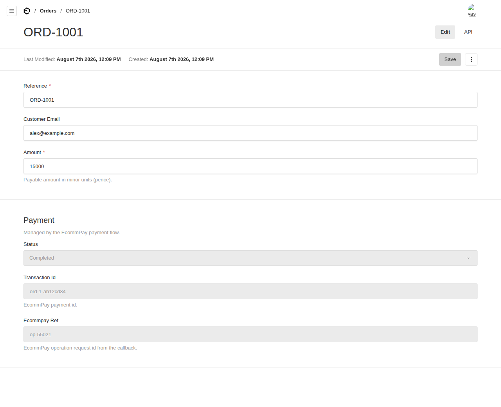
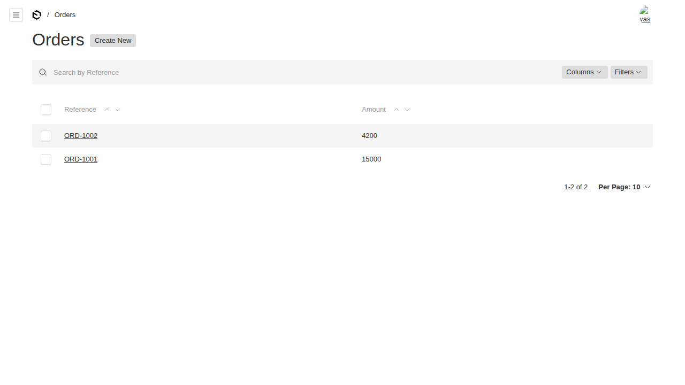

# @foundrykit/ecommpay-plugin

An [EcommPay](https://ecommpay.com) payment adapter for [Payload CMS 3](https://payloadcms.com). Take payments against **any** collection's documents — orders, contributions, bookings, vouchers — with SDK-accurate HMAC signing, a hosted-payment-page widget, and verified, idempotent callbacks.

Extracted from the Turquoise project and made collection-agnostic: you declare which collections are payable, and the plugin handles id encoding, signing, callback verification and order-status updates.

## Features

- **Collection-agnostic** — register any number of "sources" (collections). Payment ids embed a per-source prefix so callbacks route back to the right collection, even for UUID order ids.
- **SDK-accurate signing** — the HMAC-SHA512 signature exactly mirrors EcommPay's official SDK (verified in tests against the real `ecommpay` package), so the hosted page and callbacks both accept it.
- **Verified, idempotent callbacks** — invalid signatures are rejected; a completed/failed order is never re-transitioned, so EcommPay's retries are safe.
- **Conservative status mapping** — only a confirmed success completes an order; only explicit terminal failures fail it; anything mid-flight stays `pending`.
- **Injected payment state** — a read-only `payment` group (status / transactionId / ecommpayRef) is added to each source collection automatically (opt-out available).
- **Three endpoints, wired for you** — `initiate`, `callback`, `status` under `/api/payments/ecommpay`.
- **Framework-agnostic widget** — `<EcommpayWidget>` is pure React (no Next dependency) and mounts the hosted payment page from signed params.

## Screenshots

**An order with the injected, read-only `Payment` group** (written by the payment flow, not editors)



**Orders list**



---

## Installation

```sh
pnpm add @foundrykit/ecommpay-plugin
```

Peer deps: `payload` (and `react` if you use the widget). The `ecommpay` SDK is bundled as a dependency.

Set your credentials in the environment (or pass them in config):

```
ECOM_PROJECT_ID=112
ECOM_SECRET_KEY=your_secret_key
```

## Quick start

```ts
// payload.config.ts
import { ecommpayPlugin } from '@foundrykit/ecommpay-plugin'
import { buildConfig } from 'payload'

export const ecommpayConfig = {
  currency: 'GBP',
  sources: [
    // amount read from `order.amount` (minor units / pence)
    { collection: 'orders', prefix: 'ord', amountField: 'amount' },
    // or resolve it yourself
    { collection: 'contributions', prefix: 'gl', resolveAmount: (o) => Number(o.totalValue) || 0 },
  ],
}

export default buildConfig({
  collections: [/* orders, contributions, … */],
  plugins: [ecommpayPlugin(ecommpayConfig)],
})
```

The plugin adds a read-only `payment` group to each source collection and registers the endpoints. Amounts are always in **minor units** (pence).

### The payment flow

1. **Initiate** — your frontend POSTs `{ collection, orderId }` to `/api/payments/ecommpay/initiate`. The plugin validates the order is pending and payable, mints + stores a payment id, and returns signed widget params.

   ```ts
   const res = await fetch('/api/payments/ecommpay/initiate', {
     method: 'POST',
     headers: { 'Content-Type': 'application/json' },
     body: JSON.stringify({ collection: 'orders', orderId }),
   })
   const params = await res.json() // WidgetParams
   ```

2. **Pay** — mount the widget with those params:

   ```tsx
   import { EcommpayWidget } from '@foundrykit/ecommpay-plugin/client'

   <EcommpayWidget params={params} onSuccess={() => router.push('/thank-you')} />
   ```

3. **Callback** — EcommPay POSTs to `/api/payments/ecommpay/callback`. The plugin verifies the signature, maps the status, and updates the order idempotently. Point your EcommPay project's callback URL here.

4. **Status** — poll `/api/payments/ecommpay/status?collection=orders&orderId=…` for `{ status, transactionId }`.

### Using the pieces directly

Every step is also exported, so you can wire your own hooks/routes:

```ts
import { initiatePayment, parseCallback, applyPaymentResult } from '@foundrykit/ecommpay-plugin'

const params = await initiatePayment(payload, { collection: 'orders', orderId }, ecommpayConfig)

const result = parseCallback(body, ecommpayConfig)      // null if signature invalid
if (result) await applyPaymentResult(ctx, result.ref, result.status, result.ecommpayRef)
```

---

## Configuration

```ts
ecommpayPlugin({
  sources: PaymentSource[]           // required
  currency?: string                  // default 'GBP'
  projectId?: number                 // else ECOM_PROJECT_ID
  secretKey?: string                 // else ECOM_SECRET_KEY
  paymentPageBaseUrl?: string        // default https://paymentpage.ecommpay.com
  paymentFieldName?: string          // group field name, default 'payment'
  addPaymentField?: boolean          // inject the payment group, default true
  basePath?: string                  // endpoint base, default '/payments/ecommpay'
  disabled?: boolean                 // register the field but skip endpoints
})
```

**`PaymentSource`** — `{ collection, prefix, amountField?, resolveAmount? }`. `prefix` must be unique and dash-free; `amountField` (default `amount`) or `resolveAmount` gives the payable amount in minor units.

## Security notes

- Callbacks are only trusted after the EcommPay SDK verifies the signature against your secret key. Keep `ECOM_SECRET_KEY` server-side only.
- `applyPaymentResult` is idempotent, so EcommPay's at-least-once callback delivery won't double-process an order.
- Order writes use `overrideAccess: true` deliberately — the payment flow is a trusted server context, not an end-user request.

## Exports

- `@foundrykit/ecommpay-plugin` — `ecommpayPlugin`, `initiatePayment`, `parseCallback`, `applyPaymentResult`, `readPayment`, `createEcommpayEndpoints`, `paymentField`, `sign`, `encodePaymentId`/`decodePaymentId`, `mapEcommpayStatus`, and all types.
- `@foundrykit/ecommpay-plugin/client` — `EcommpayWidget`.

## Development

```sh
pnpm install
pnpm dev          # dev admin at http://localhost:3000/admin (sqlite, seeded orders)
pnpm test         # unit + integration + e2e
pnpm test:unit    # signing (checked against the real ecommpay SDK), id codec, status map
pnpm test:int     # full initiate → signed callback → complete flow on a real Payload instance
pnpm build && pnpm verify:pack
```

## License

MIT © Isaac SJ / Umi
